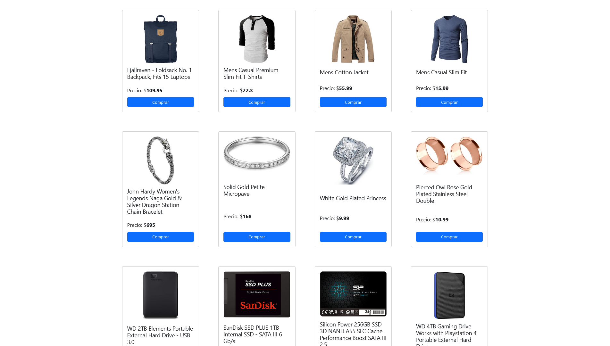

# Nexio Ecommerce

Proyecto Nexio Ecommerce para el curso Front-End JS de Talento Tech año 2024.
Este proyecto consiste en la creación de un sitio web de e-commerce dinámico e interactivo, que consuma datos de una API REST para mostrar
productos, y permita a los usuarios añadir productos a un carrito de compras.
El proyecto fue realizado  con HTML, CSS, JavaScript y Boostrap.

## Screenshots

## Utilidades

La Api rest utilizada en este proyecto es: [FakeStoreApi](https://fakestoreapi.com/)

Las imágenes fueron utilizadas de: [Unsplash](https://unsplash.com/es)

Los ínconos fueron utilizados de: [Boostrap](https://getbootstrap.com/)
